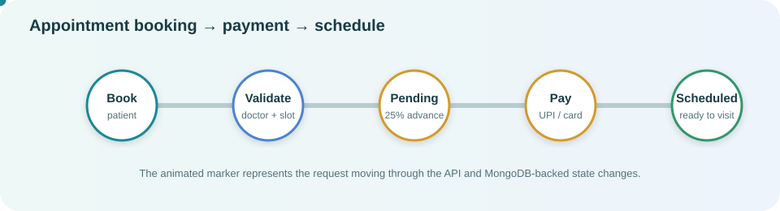
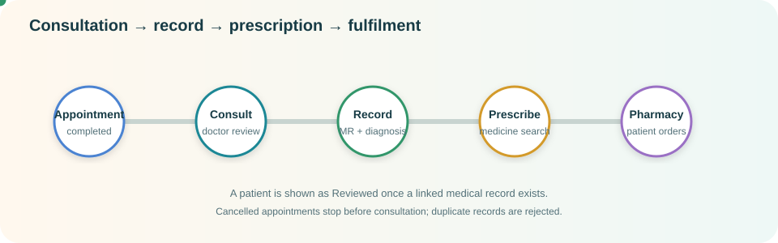
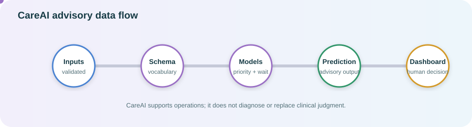

# CARE-OS Workflow and Data Flow

This document describes how a request moves through the CARE-OS frontend, FastAPI backend, MongoDB,
clinical workflows, payment state, pharmacy operations, and CareAI advisory services.

The diagrams use animated SVG markers. If a Markdown viewer does not animate SVGs, the labels and
state descriptions below remain the source of truth.

## 1. System boundary

```text
Patient / Doctor / Staff
        │
        ▼
React frontend ── HTTP + JWT ──► FastAPI routes/controllers
                                      │
                                      ▼
                              Services + validation
                                      │
                    ┌─────────────────┼─────────────────┐
                    ▼                 ▼                 ▼
                 MongoDB          CareAI models      File storage
                    │                 │
                    ▼                 ▼
              persisted records   operational advice
```

The frontend collects input and displays state. The backend authorizes the user, validates the
workflow, writes related documents, and returns the authoritative result.

## 1.1 Patient identity and registration

Reception creates a patient record with a stable unique Patient ID such as `PAT000001`. The linked
login is derived from that Patient ID (`PAT000001@CareOS`), never from the patient's name, so two
patients with the same name remain isolated. The temporary password is generated once, returned only
in the credential ticket, and stored only as a hash. Email is validated and stored for future
notifications; CARE-OS does not send email yet.

The receptionist's selected doctor is stored as `assigned_doctor_id` on the patient document. After
patient login, the portal resolves that ID against the authenticated patient's profile and the doctor
directory; it never uses a doctor name or a patient-controlled cross-account lookup.

## 2. Appointment and advance-payment flow



1. A patient selects a doctor, date, time, appointment type, and reason.
2. The frontend submits the booking request to the appointments API.
3. The backend validates the patient, doctor, schedule conflict, and appointment data.
4. A valid booking starts in `Payment Pending`.
5. The patient chooses UPI, UPI ID, credit card, or debit card and submits the simulated 25% advance.
6. UPI displays the repository QR asset `UPI.svg`. Card numbers are formatted as four groups of four,
   expiry is `MM/YY`, expired cards are rejected, and CVV is limited to three digits.
7. A successful advance updates the appointment into the scheduled/confirmed flow with payment
   status `Partially Paid`; failed payment leaves the appointment pending.

Scheduling calendar: every Sunday is a holiday. Saturday appointments are available only from
11:00 AM through 2:00 PM; the backend rejects requests outside that window even if they bypass the UI.

Important rule: payment details are validated at the boundary and sensitive card values are not used
as clinical data.

## 3. Clinical consultation and prescription flow



1. A doctor sees appointments scoped to their doctor account.
2. Only a scheduled appointment without a medical record can show `Record consultation`.
3. Cancelled or completed appointments cannot start a new consultation.
4. The doctor records diagnosis, symptoms, vitals, treatment, notes, and follow-up information. If
   the medical record already exists, the screen changes to `Add prescription` and reuses that record;
   it does not attempt to create a duplicate consultation.
5. The backend links the medical record to the same appointment, patient, and doctor, then rejects
   duplicate records for that appointment.
6. The doctor can prescribe medicines from the expanded catalog. Each new medicine records its
   catalogue ID, selected frequency values (`Morning`, `Afternoon`, or `Evening`), and quantity
   (`5`, `10`, `15`, or `20`). Dosage, duration, instructions, and number of doses are not required
   inputs in the current form. Disease choices are scoped to the selected doctor's department/specialty.
7. A valid prescription creates or reuses one pharmacy order. The prescription is the clinical source;
   the order stores a server-side snapshot for fulfillment.
8. The patient may choose `FULL` or `HALF` fulfillment. The backend calculates and stores the
   fulfillment quantity without changing the prescription, then moves the order to `PENDING_PAYMENT`.
9. After payment, the order becomes `READY_FOR_PICKUP` and receives a one-time pickup token and QR
   payload. Cash/on-counter payments wait for pharmacy confirmation.
10. Pharmacy staff validate the token atomically and mark the order `COLLECTED`.
11. Existing operational orders may still use the legacy pharmacy processing path:

   ```text
   PENDING → ACCEPTED → PACKED → DISPENSED
   ```

12. The patient's dashboard receives the persisted medical record, prescription, fulfillment choice,
    payment state, pickup token, and order status.
13. The doctor dashboard only opens the review/prescribing form for a patient with a matching
    appointment and medical record. Patients with a scheduled appointment are sent to
    `Record consultation` first; patients without one cannot start prescribing.
14. Once a record exists, the doctor dashboard displays `Reviewed` and the record ID instead of
    offering the same review action again.
15. Saving the consultation settles the remaining 75%: payment status becomes `Paid`, total paid
    equals the consultation fee, and remaining amount becomes `₹0`.

## 4. CareAI advisory flow



CareAI has two operational models:

- Patient priority classification.
- Estimated waiting-time regression.

The request path is:

1. The UI obtains the accepted input schema and vocabulary from `/ai/schema`.
2. The user submits validated patient attributes to the appropriate AI endpoint.
3. The backend rejects categorical values outside the fitted model vocabulary and numeric values
   outside safe ranges.
4. The service loads the serialized scikit-learn pipeline and returns the prediction.
5. The dashboard presents the result as advisory information for human operational decisions.

CareAI output is not a diagnosis, guaranteed clinical decision, or replacement for a doctor.

## 5. Identity and authorization flow

```text
Login ID + password
        │
        ▼
Auth API verifies bcrypt password hash
        │
        ▼
JWT with user identity and role
        │
        ▼
Protected request
        │
        ▼
Backend resolves current user from MongoDB
        │
        ├── role check
        ├── ownership / clinical relationship check
        ├── schema and state validation
        └── audit logging where required
```

Development accounts are seeded only in development mode. Passwords are stored as hashes; the
plaintext password is never returned by the API. Hospital doctor accounts are linked to doctor IDs
`DOC000101` through `DOC000107`.

## 6. State and data ownership rules

| Data | Created by | Main relationship | Visible to |
|---|---|---|---|
| Patient | Receptionist or registration flow | Patient account | Authorized staff and patient |
| Appointment | Patient/receptionist workflow | Patient + doctor | Linked patient, doctor, permitted staff |
| Advance payment | Booking payment flow | Appointment | Authorized booking context |
| Medical record | Doctor consultation | Appointment + patient + doctor | Linked clinical users and patient |
| Prescription | Doctor | Medical record | Doctor, pharmacy, patient |
| Pharmacy order | Backend prescription service | Prescription | Pharmacy and patient |
| CareAI prediction | Authorized AI request | Patient context | Authorized clinical/operational user |

The backend is authoritative for every relationship. UI state, displayed slot availability, and
client-side validation are conveniences and never replace backend authorization or validation.

## 7. Startup data behavior

Normal startup does not create demo patients, appointments, medical records, prescriptions, or
pharmacy orders. Retired `*DEMO` clinical records are removed, while the hospital doctor directory
and its development logins are ensured. Real patients and appointments are created through the app.

For the broader architecture and API details, see [README.md](README.md),
[CARE-OS-SYSTEM-LOGIC.md](CARE-OS-SYSTEM-LOGIC.md), [backend.md](backend.md), and
[frontend.md](frontend.md).
